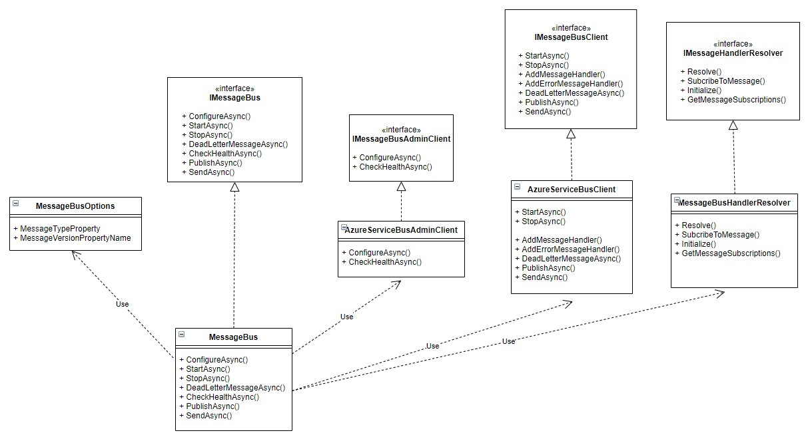

# MessageBus

## Overview

MessageBus is an abstraction layer for messaging technologies such as Azure Service Bus and RabbitMQ and provides message routing to message handlers based on the type of the message which is set in the message label or a message property.

- [MessageBus](#messagebus)
  - [Overview](#overview)
  - [Getting Started with MessageBus and Azure Service Bus](#getting-started-with-messagebus-and-azure-service-bus)
    - [Prerequisites](#prerequisites)
    - [1. Create messages](#1-create-messages)
    - [2. Create a message handler](#2-create-a-message-handler)
    - [3. Subscribe to messages and add MessageBus](#3-subscribe-to-messages-and-add-messagebus)
      - [Authenticate with Managed Identity](#authenticate-with-managed-identity)
      - [Authenticate with a connection string](#authenticate-with-a-connection-string)
    - [4. Add services that only send messages](#4-add-services-that-only-send-messages)
      - [Send a command](#send-a-command)
      - [Publish an event](#publish-an-event)
    - [5. Add settings to appsettings.json](#5-add-settings-to-appsettingsjson)
      - [Managed Identity settings](#managed-identity-settings)
      - [Connection String settings](#connection-string-settings)
  - [Sending messages](#sending-messages)
    - [Send commands or publish events from a message handler](#send-commands-or-publish-events-from-a-message-handler)
    - [Send commands or publish events from a service](#send-commands-or-publish-events-from-a-service)
    - [Set custom properties on messages](#set-custom-properties-on-messages)
    - [Send message copy with optional delay](#send-message-copy-with-optional-delay)
    - [Sending messages with delay](#sending-messages-with-delay)
  - [Working with messages](#working-with-messages)
    - [Deserializing messages](#deserializing-messages)
    - [Get message properties](#get-message-properties)
    - [Get message context properties](#get-message-context-properties)
    - [Start listening for messages](#start-listening-for-messages)
    - [Dead lettering messages](#dead-lettering-messages)
    - [Message Processors](#message-processors)
    - [Message Versioning](#message-versioning)
    - [Change the default properties (MessageVersion)](#change-the-default-properties-messageversion)
    - [Using custom subscription filters](#using-custom-subscription-filters)
  - [Health checks](#health-checks)
  - [Azure Service Bus](#azure-service-bus)
    - [Configuring Service Bus Processor options](#configuring-service-bus-processor-options)
    - [Configuring Service Bus Subscription Options](#configuring-service-bus-subscription-options)
  - [Upgrade paths and breaking changes](#upgrade-paths-and-breaking-changes)
    - [Version 1.x.x to 2.x.x](#version-1xx-to-2xx)
  - [Programming model](#programming-model)

## Getting Started with MessageBus and Azure Service Bus

MessageBus calls the message handler for the message type that is received based on the `Label` of the message. For example, when a message is received with a `Label` set to `AircraftTakenOff`, the `HandleAsync()` method on the handler for that message type is called.

For a full example, see `MessageBus.HostedService.Example` project in the `examples` folder.

### Prerequisites

* Create an ASP .NET web application using the standard .NET template
* Add the MessageBus NuGet packages to your web application project:
  * MessageBus.Abstractions
  * MessageBus.Microsoft.ServiceBus
  * MessageBus.Extensions.Microsoft.DependencyInjection
* Assign permissions to the managed identity or configure the Shared Access Policy so that MessageBus can create a subscription on the topic and send and receive messages

### 1. Create messages

To create a message, you can either implement the `IEvent` or `ICommand` interface depending on whether you are handling an event or command. An example event is below:

```csharp
using MessageBus.Abstractions;

namespace MessageBus.HostedService.Example.Events
{
    public class AircraftTakenOff : IEvent
    {
        public string AircraftId { get; set; }
        public string SourceAirport { get; set; }
    }
}
```

```csharp
using MessageBus.Abstractions;

namespace MessageBus.HostedService.Example.Events
{
    public class AircraftLeftAirspace : IEvent
    {
        public string Airspace { get; set; }
    }
}
```

### 2. Create a message handler

To create a message handler that receives an `AircraftTakenOff` event, create a class that implements the `IMessageHandler<T>` interface. An simple example is below:

```csharp
using MessageBus.Abstractions;
using MessageBus.HostedService.Example.Events;
using MessageBus.HostedService.Example.Services;
using System;
using System.Text.Json;
using System.Threading.Tasks;

namespace MessageBus.HostedService.Example.Handlers
{
    public class AircraftTakenOffHandler : IMessageHandler<AircraftTakenOff>
    {
        private readonly IDependency _dependency;

        public AircraftTakenOffHandler(IDependency dependency)
        {
            _dependency = dependency;
        }

        public async Task HandleAsync(IMessageContext<AircraftTakenOff> context)
        {
            Console.WriteLine($"{nameof(AircraftTakenOff)} message received");

            // Do stuff
            _dependency.SaveMessageId(Guid.Parse(context.MessageId));

            // Publish a new event
            var aircraftLeftAirspaceEvent = new AircraftLeftAirspace { Airspace = "London" };
            await context.PublishAsync(new Message<IEvent>(aircraftLeftAirspaceEvent));
        }
    }
}
```

### 3. Subscribe to messages and add MessageBus

When starting up, MessageBus will generate a list of the different message types and message handlers then create the subscription and the subscription filters if they do not already exist. This is idempotent so that redeployments or rolling deployments do not cause downtime.

This can be done using the `IServiceCollection` extension methods in conjunction with .NET Core/.NET 5 Dependency Injection. The hosted service `MessageBusHostedService` starts up and starts listening to messages.

You can either authenticate with Managed Identity or a Connection String.

#### Authenticate with Managed Identity
```csharp
using MessageBus.Extensions.Microsoft.DependencyInjection;
using MessageBus.Microsoft.ServiceBus;
using MessageBus.HostedService.Example.Events;
using MessageBus.HostedService.Example.Handlers;
using MessageBus.HostedService.Example.Services;
using Microsoft.AspNetCore.Builder;
using Microsoft.Extensions.Configuration;
using Microsoft.Extensions.DependencyInjection;

namespace MessageBus.HostedService.Example
{
    public class Startup
    {
        public IConfiguration Configuration { get; }

        public Startup(IConfiguration configuration)
        {
            Configuration = configuration;
        }

        public void ConfigureServices(IServiceCollection services)
        {
            services.AddHostedService<MessageBusHostedService>()
                .AddSingleton<IDependency, SomeDependency>()
                .AddMessageBus(new AzureServiceBusClientBuilder(Configuration["ServiceBus:Hostname"],
                        Configuration["ServiceBus:Topic"], Configuration["ServiceBus:Subscription"],
                        Configuration["ServiceBus:TenantId"]))
                    .SubscribeToMessage<AircraftTakenOff, AircraftTakenOffHandler>();
        }

        public void Configure(IApplicationBuilder app)
        {
            app.UseRouting();

            app.UseEndpoints(endpoints =>
            {
                endpoints.MapHealthChecks("/health");
            });
        }
    }
}
```

#### Authenticate with a connection string
```csharp
        private static ServiceProvider ConfigureServices()
        {
            var services = new ServiceCollection();
            services.AddMessageBus(new AzureServiceBusClientBuilder(Configuration["ServiceBus:ConnectionString"],
                            Configuration["ServiceBus:Topic"], Configuration["ServiceBus:Subscription"]))
                        .SubscribeToMessage<AircraftTakenOff, AircraftTakenOffHandler>();
            
            return services.BuildServiceProvider();
        }
```

### 4. Add services that only send messages

If you only need to send a message rather than also receive messages then you can inject `IMessageBus` into your class and use the `SendAsync()` or `PublishAsync()` methods as below to send either a Command or Event respectively.

#### Send a command
```csharp
using MessageBus.Abstractions;
using System;
using System.Threading.Tasks;

namespace MessageBus.Microsoft.ServiceBus.Tests.Integration.Services
{
    internal class SendingService : ISendingService
    {
        private readonly IMessageBus _messageBus;
        private readonly ISomeDependency _someDependency;

        public SendingService(IMessageBus messageBus, ISomeDependency someDependency)
        {
            _messageBus = messageBus;
            _someDependency = someDependency;
        }

        public Task SendAsync(ICommand message)
        {
            _someDependency.Ids.Add(Guid.NewGuid().ToString());
            return _messageBus.SendAsync(new Message<ICommand>(message));
        }
    }
}
```

#### Publish an event
```csharp
using MessageBus.Abstractions;
using System;
using System.Threading.Tasks;

namespace MessageBus.Microsoft.ServiceBus.Tests.Integration.Services
{
    internal class PublishingService : IPublishingService
    {
        private readonly ISomeDependency _someDependency;
        private readonly IMessageBus _messageBus;

        public PublishingService(IMessageBus messageBus, ISomeDependency someDependency)
        {
            _someDependency = someDependency;
            _messageBus = messageBus;
        }

        public async Task PublishAsync(IEvent message)
        {
            _someDependency.Ids.Add(Guid.NewGuid().ToString());
            await _messageBus.PublishAsync(new Message<IEvent>(message));
        }
    }
}
```

### 5. Add settings to appsettings.json

#### Managed Identity settings
```json
{
  "ServiceBus": {
    "Hostname": "myservicebus.servicebus.windows.net",
    "Topic": "topic1",
    "Subscription": "MessageBusHostedServiceExample",
    "TenantId": "12345-12345-12345-12345-12345-12345"
  }
}
```

#### Connection String settings
```json
{
  "ServiceBus": {
    "ConnectionString": "Endpoint=sb://sb43719.servicebus.windows.net/;SharedAccessKeyName=RootManageSharedAccessKey;SharedAccessKey=wukLQ5hMBn96H4Ea9us7P5ARqT+9S51LsDlL9EJtUz4=",
    "Topic": "topic1",
    "Subscription": "MessageBusHostedServiceExample"
  }
}
```

## Sending messages

You can either publish an IEvent or send an ICommand. In either case, the Type of the message being sent is automatically used as the `Label` on the sent message.

You can publish an IEvent or simple string. Likewise, you can either send an ICommand or a simple string.

When sending messages from handlers using `MessageContext.SendAsync()` or `MessageContext.PublishAsync()`, these messages will have the same `CorrelationId` as the received message however this can be overridden by setting properties on `Message<IEvent>` or `Message<ICommand>`.

### Send commands or publish events from a message handler

You can send commands or publish events from ICommand objects or IEvent objects respectively or you can send just a string as a message. See below.

```csharp
using MessageBus.Abstractions;
using MessageBus.Microsoft.ServiceBus.Tests.Integration.Models;
using System.Threading.Tasks;

namespace MessageBus.Microsoft.ServiceBus.Tests.Integration.Handlers
{
    public class AircraftLeftRunwayHandler : IMessageHandler<AircraftLeftRunway>
    {
        public async Task HandleAsync(IMessageContext<AircraftLeftRunway> context)
        {
            // Publish an event from an IEvent e.g. AircraftReachedGate
            var aircraftReachedGateEvent = new AircraftReachedGate { AirlineId = context.Message.RunwayId };
            await context.PublishAsync(new Message<IEvent>(aircraftReachedGateEvent));

            // Publish an event from a string
            await context.PublishAsync(new Message<IEvent>("Hello world!"));

            // Publish a command from an ICommand e.g. StartEngines
            var startEnginesCommand = new StartEngines { EngineId = context.Message.Destination };
            await context.SendAsync(new Message<ICommand>(startEnginesCommand));
            
            // Publish a command from a string
            await context.SendAsync(new Message<ICommand>("Hello world!"));
        }
    }
}
```

### Send commands or publish events from a service

You can send commands or publish events from ICommand objects or IEvent objects respectively or you can send just a string as a message. See below.

```csharp
using MessageBus.Abstractions;
using System;
using System.Threading.Tasks;

namespace MessageBus.Microsoft.ServiceBus.Tests.Integration.Services
{
    internal class Service : IService
    {
        private readonly ISomeDependency _someDependency;
        private readonly IMessageBus _messageBus;

        public Service(IMessageBus messageBus, ISomeDependency someDependency)
        {
            _someDependency = someDependency;
            _messageBus = messageBus;
        }

        public async Task SendMessages()
        {
            // Publish an event from an IEvent e.g. AircraftReachedGate
            var aircraftReachedGateEvent = new AircraftReachedGate { AirlineId = context.Message.RunwayId };
            await _messageBus.PublishAsync(new Message<IEvent>(aircraftReachedGateEvent));
            
            // Publish an event from a string
            await _messageBus.PublishAsync(new Message<IEvent>("Hello world!"));

            // Publish a command from an ICommand e.g. StartEngines
            var startEnginesCommand = new StartEngines { EngineId = context.Message.Destination };
            await _messageBus.SendAsync(new Message<ICommand>(startEnginesCommand));
            
            // Publish a command from a string
            await _messageBus.SendAsync(new Message<ICommand>("Hello world!"));
        }
    }
}
```

### Set custom properties on messages

You can set custom message properties on messages that are sent.

`MessageId` and `CorrelationId` can also be overridden. By default `MessageId` defaults to a new Guid. `CorrelationId` defaults to null if sending from an injected instance of `IMessageBus` but defaults to the `CorrelationId` of the received message when sending using `MessageContext<T>` within a message handler.

```csharp
public async Task SendMessages()
{
    var eventObject = new Message<IEvent>("Hello World!")
    {
        OverrideDefaultMessageProperties = false,
        CorrelationId = "MyCorrelationId",
        MessageId = "MyMessageId",
        MessageProperties = new Dictionary<string, string>
        {
            { "AircraftType", "Commercial" },
            { "AircraftSize", "Heavy" }
        }
    };

    await _messageBus.PublishAsync(eventObject);
}
```

### Send message copy with optional delay

From within a message handler, you can send a message copy which is an exact copy of the received message and you can also specify a delay in seconds or specify a time for the message to appear on the subscription which is quite useful if you want to retry the message at a later stage.

Note that with Service Bus, the message copy feature does not increment the dequeue count. All message properties and data remain the same.

If the message enqueue time has already passed then the message will be sent immediately.

```csharp
using MessageBus.Abstractions;
using MessageBus.Microsoft.ServiceBus.Tests.Integration.Models;
using System.Threading.Tasks;

namespace MessageBus.Microsoft.ServiceBus.Tests.Integration.Handlers
{
    public class AircraftLeftRunwayHandlerWithCopy : IMessageHandler<AircraftLeftRunway>
    {
        public async Task HandleAsync(IMessageContext<AircraftLeftRunway> context)
        {
            try
            {
                // do something
            }
            catch
            {
                // Send a message copy which is queued immediately
                await context.SendMessageCopyAsync();

                // Send a message copy which is queued in 10 seconds
                await context.SendMessageCopyAsync(delayInSeconds: 10);

                // Send a message copy which is queued at a specific time
                await context.SendMessageCopyAsync(enqueueTime: DateTimeOffset.Parse("08/03/2021 20:15"));
            }
        }
    }
}
```

### Sending messages with delay

You can schedule when a message gets queued by setting the `ScheduledEnqueueTime` property on the `Message<T>` object. 

See below for how to publish an event with a delay of 10 seconds from now. The same is when sending a command, i.e. you set the same `ScheduledEnqueueTime` property on the `Message<T>` object.

```csharp
using MessageBus.Abstractions;
using System;
using System.Threading.Tasks;

namespace MessageBus.Microsoft.ServiceBus.Tests.Integration.Services
{
    internal class PublishingServiceWithDelay : IPublishingService
    {
        private readonly IMessageTracker _messageTracker;
        private readonly IMessageBus _messageBus;

        public PublishingServiceWithDelay(IMessageBus messageBus, IMessageTracker messageTracker)
        {
            _messageTracker = messageTracker;
            _messageBus = messageBus;
        }

        public async Task DoSomething()
        {
            _messageTracker.Ids.Add(Guid.NewGuid().ToString());

            var aircraftTakenOffEvent = new AircraftTakenOff 
            {
                AircraftId = Guid.NewGuid().ToString() 
            };

            var message = new Message<IEvent>(aircraftTakenOffEvent)
            {
                ScheduledEnqueueTime = DateTimeOffset.Now.AddSeconds(10)
            };

            await context.PublishAsync(message);
        }
    }
}
```

## Working with messages

### Deserializing messages

```csharp
// Deserialize message using default deserializer
Console.WriteLine($"AircraftId: {context.Message.AircraftId}");

// Deserialize message using custom JSON Serializer
var jsonOptions = new JsonSerializerOptions() { PropertyNameCaseInsensitive = true };
Console.WriteLine($"AircraftId: {context.Body.ToObjectFromJson<AircraftTakenOff>(jsonOptions).AircraftId}");
```

### Get message properties

```csharp
Console.WriteLine($"MessageType: {context.Properties["MessageType"]}");
```

### Get message context properties

```csharp
Console.WriteLine($"MessageId: {context.MessageId}");
Console.WriteLine($"CorrelationId: {context.CorrelationId}");
Console.WriteLine($"DeliveryCount: {context.DeliveryCount}");
Console.WriteLine($"Raw message as text: {context.Body}");
```

### Start listening for messages

If not using the hosted service, to start listening for messages, configure and start MessageBus by calling the relevant methods on `IMessageBus`:
* `ConfigureAsync()` creates the subscription and subscription filters
* `StartAsync()` starts Message Bus and starts processing messages

```csharp
await serviceProvider.GetRequiredService<IMessageBus>().ConfigureAsync();
await serviceProvider.GetRequiredService<IMessageBus>().StartAsync();
```

### Dead lettering messages

Within a message handler, you can call the `DeadLetterAsync()` method on the `IMessageContext` as below. The dead letter reason is optional.

```csharp
using MessageBus.Abstractions;
using ServiceBus1.Events;
using System;
using System.Text.Json;
using System.Threading.Tasks;

namespace ServiceBus1.Handlers
{
    public class AircraftTakenOffHandler : IMessageHandler<AircraftTakenOff>
    {
        public async Task HandleAsync(IMessageContext<AircraftTakenOff> context)
        {
            try
            {
                Console.WriteLine($"AircraftId using JSON serializer options: {context.Body.ToObjectFromJson<AircraftTakenOff>().AircraftId}");
            }
            catch (Exception)
            {
                await context.DeadLetterMessageAsync("Invalid message");
                throw;
            }
        }
    }
}
```

### Message Processors

A message processor can be an `IMessagePreProcessor` which is called whenver any message is received or an `IMessagePostProcessor` which is called after any message handler has been called. You can add multiple pre-processors and post-processors.

As these will apply to all messages, avoid having any business logic in your message processors. They are designed for logging or the inbox pattern.

Example message pre-processor below simply logs the `MessageId` of the received message:

```csharp
using MessageBus.Abstractions;
using Microsoft.Extensions.Logging;
using System.Threading.Tasks;

namespace MessageBus.HostedService.Example.Processors
{
    public class MessageReceivedLogger : IMessagePreProcessor
    {
        private readonly ILogger<MessageReceivedLogger> _logger;

        public MessageReceivedLogger(ILogger<MessageReceivedLogger> logger)
        {
            _logger = logger;
        }

        public async Task ProcessAsync<T>(IMessageContext<T> context) where T : IMessage
        {
            _logger.LogInformation($"Message received with MessageId: {context.MessageId}");
        }
    }
}
```

To add message processors, use the `AddMessagePreProcessor` and `AddMessagePostProcessor` methods as below. If adding more than one pre-processor or post-processor, these will be called in the order they are added.

```csharp
using MessageBus.Extensions.Microsoft.DependencyInjection;
using MessageBus.Microsoft.ServiceBus;
using MessageBus.HostedService.Example.Events;
using MessageBus.HostedService.Example.Handlers;
using MessageBus.HostedService.Example.Services;
using Microsoft.AspNetCore.Builder;
using Microsoft.Extensions.Configuration;
using Microsoft.Extensions.DependencyInjection;
using MessageBus.HostedService.Example.Processors;

namespace MessageBus.HostedService.Example
{
    public class Startup
    {
        public IConfiguration Configuration { get; }

        public Startup(IConfiguration configuration)
        {
            Configuration = configuration;
        }

        public void ConfigureServices(IServiceCollection services)
        {
            services.AddHostedService<MessageBusHostedService>()
                .AddSingleton<IDependency, SomeDependency>()
                .AddMessageBus(new AzureServiceBusClientBuilder(Configuration["ServiceBus:Hostname"],
                        Configuration["ServiceBus:Topic"], Configuration["ServiceBus:Subscription"],
                        Configuration["ServiceBus:TenantId"]))
                    .SubscribeToMessage<AircraftTakenOff, AircraftTakenOffHandler>()
                    .AddMessagePreProcessor<MessageReceivedLogger>()
                    .AddMessagePostProcessor<MessageProcessedLogger>();
            services.AddHealthChecks().AddCheck<MessageBusHealthCheck>("MessageBus");
        }

        public void Configure(IApplicationBuilder app)
        {
            app.UseRouting();

            app.UseEndpoints(endpoints =>
            {
                endpoints.MapHealthChecks("/health");
            });
        }
    }
}

```

### Message Versioning

When making breaking changes to messages, you may want to pin message receivers to a particular message version so you don't need to update all receivers when your sender sends a new message version with a breaking change. To do this, you can use the `MessageVersion` attribute on the message and this will be added as a `MessageVersion` property on the message.

```csharp
using MessageBus.Abstractions;
using System;

namespace MessageBus.Microsoft.ServiceBus.Tests.Integration.Models.V2
{
    [MessageVersion(2)]
    public class AircraftLanded : IEvent
    {
        public string AircraftId { get; init; }
        public string FlightNumber { get; init; }
        public DateTime Timestamp { get; init; }
    }
}
```

### Change the default properties (MessageVersion)

If using Azure Service Bus, the `AzureServiceBusAdminClient` is used to create and configure the subscription. By default, the message property that determines the message version is called `MessageVersion` however this can be configured by passing `MessageBusOptions` into `AddMessageBus()`.

```csharp
using MessageBus.Abstractions;
using MessageBus.Example.Events;
using MessageBus.Example.Handlers;
using MessageBus.Extensions.Microsoft.DependencyInjection;
using MessageBus.Microsoft.ServiceBus;
using Microsoft.Extensions.Configuration;
using Microsoft.Extensions.DependencyInjection;

namespace MessageBus.Example
{
    public class Startup
    {
        public static IConfiguration Configuration { get; private set; }

        public static ServiceProvider Initialize()
        {
            BuildConfiguration();
            return ConfigureServices();
        }

        private static void BuildConfiguration()
            => Configuration = new ConfigurationBuilder()
                .AddJsonFile("appsettings.json", optional: false, reloadOnChange: true)
                .AddUserSecrets<Program>()
                .Build();

        private static ServiceProvider ConfigureServices()
        {
            var options = new MessageBusOptions
            {
                MessageVersionPropertyName = "MyMessageVersion"
            };

            var services = new ServiceCollection();
            services.AddMessageBus(new AzureServiceBusClientBuilder(Configuration["ServiceBus:Hostname"],
                            Configuration["ServiceBus:Topic"], Configuration["ServiceBus:Subscription"],
                            Configuration["ServiceBus:TenantId"]))
                            Configuration["ServiceBus:TenantId"]), options)
                        .SubscribeToMessage<AircraftTakenOff, AircraftTakenOffHandler>();
            
            return services.BuildServiceProvider();
        }
    }
}
```

### Using custom subscription filters

To do this, simply create a `SubscriptionFilter` and pass this to the `SubscribeToMessage()` method. Note that specifying custom message properties will mean that `MessageVersion` will not be added so you will need to add this yourself.

Messages will be routed according to the label (preferred) and if this is not specified then the `MessageType` property (or a custom message type property set using `MessageBusOptions`) is used and if this also does not exist then the label on the subscription filter is set to the name of the `Type` of the message.

```csharp
private static ServiceProvider ConfigureServices()
{
    var services = new ServiceCollection();

    var customMessageSubscriptionProperties = new Dictionary<string, string>
    {
        { "AircraftType", "Commercial" },
        { "MessageType", nameof(AircraftTakenOff) },
        { "MessageVersion", "1" }
    };

    services.AddMessageBus(new AzureServiceBusClientBuilder(Configuration["ServiceBus:Hostname"],
                    Configuration["ServiceBus:Topic"], Configuration["ServiceBus:Subscription"],
                    Configuration["ServiceBus:TenantId"]))
                .SubscribeToMessage<AircraftTakenOff, AircraftTakenOffHandler>(customMessageSubscriptionProperties);
    
    return services.BuildServiceProvider();
}
```

## Health checks

This is done by using the ASP.NET built in health check in conjunction with `MessageBusHealthCheck`. In the case of Azure Service Bus, the health check will check networking and permissions by attempting to get details about the topic.

In the example below, the health status can be checked using http://myservice/health.

```csharp
using MessageBus.Extensions.Microsoft.DependencyInjection;
using MessageBus.Microsoft.ServiceBus;
using MessageBus.HostedService.Example.Events;
using MessageBus.HostedService.Example.Handlers;
using MessageBus.HostedService.Example.Services;
using Microsoft.AspNetCore.Builder;
using Microsoft.Extensions.Configuration;
using Microsoft.Extensions.DependencyInjection;

namespace MessageBus.HostedService.Example
{
    public class Startup
    {
        public IConfiguration Configuration { get; }

        public Startup(IConfiguration configuration)
        {
            Configuration = configuration;
        }

        public void ConfigureServices(IServiceCollection services)
        {
            services.AddHostedService<MessageBusHostedService>()
                .AddSingleton<IDependency, SomeDependency>()
                .AddMessageBus(new AzureServiceBusClientBuilder(Configuration["ServiceBus:Hostname"],
                        Configuration["ServiceBus:Topic"], Configuration["ServiceBus:Subscription"],
                        Configuration["ServiceBus:TenantId"]))
                    .SubscribeToMessage<AircraftTakenOff, AircraftTakenOffHandler>();
            services.AddHealthChecks().AddCheck<MessageBusHealthCheck>("MessageBus");
        }

        public void Configure(IApplicationBuilder app)
        {
            app.UseRouting();

            app.UseEndpoints(endpoints =>
            {
                endpoints.MapHealthChecks("/health");
            });
        }
    }
}
```

## Azure Service Bus

### Configuring Service Bus Processor options

You can configure options such as `PrefetchCount` and `MaxConcurrentCalls` by using another override on the `AddMessageBus()` method which takes an `AzureServiceBusAdminClient` and `AzureServiceBusClient`. You then pass `ServiceBusProcessorOptions` as a parameter when building the `AzureServiceBusClient` which means all Service Bus processor options are available:

```csharp
private static ServiceProvider ConfigureServices()
{
    var serviceBusAdminClient = new AzureServiceBusAdminClient(Configuration["ServiceBus:Hostname"],
            Configuration["ServiceBus:Topic"], Configuration["ServiceBus:Subscription"],
            Configuration["ServiceBus:TenantId"]);

    var options = new ServiceBusProcessorOptions
    {
        PrefetchCount = 10,
        MaxConcurrentCalls = 10
    };

    var serviceBusClient = new AzureServiceBusClient(Configuration["ServiceBus:Hostname"],
            Configuration["ServiceBus:Topic"], Configuration["ServiceBus:Subscription"],
            Configuration["ServiceBus:TenantId"], options);

    return new ServiceCollection()
        .SubscribeToMessage<AircraftTakenOff, AircraftTakenOffHandler>()
        .AddMessageBus(serviceBusAdminClient, serviceBusClient)
        .BuildServiceProvider();
}
```

### Configuring Service Bus Subscription Options

To set custom options such as `LockDuration` and `MaxDeliveryCount` on the Azure Service Bus subscription that is created by MessageBus, you can pass `CreateSubscriptionOptions` to the `AzureServiceBusAdminClient` when registering MessageBus.

> :warning: RequireSession and Service Bus sessions are not supported in this version of MessageBus

```csharp
using MessageBus.Extensions.Microsoft.DependencyInjection;
using MessageBus.Microsoft.ServiceBus;
using MessageBus.HostedService.Example.Events;
using MessageBus.HostedService.Example.Handlers;
using MessageBus.HostedService.Example.Services;
using Microsoft.AspNetCore.Builder;
using Microsoft.Extensions.Configuration;
using Microsoft.Extensions.DependencyInjection;
using MessageBus.HostedService.Example.Processors;
using Azure.Messaging.ServiceBus.Administration;
using System;

namespace MessageBus.HostedService.Example
{
    public class Startup
    {
        public IConfiguration Configuration { get; }

        public Startup(IConfiguration configuration)
        {
            Configuration = configuration;
        }

        public void ConfigureServices(IServiceCollection services)
        {
            var serviceBusClient = new AzureServiceBusClient(Configuration["ServiceBus:Hostname"],
                        Configuration["ServiceBus:Topic"], Configuration["ServiceBus:Subscription"],
                        Configuration["ServiceBus:TenantId"]);

            var createSubscriptionOptions = new CreateSubscriptionOptions(Configuration["ServiceBus:Topic"],
                Configuration["ServiceBus:Subscription"])
            {
                LockDuration = TimeSpan.FromSeconds(30),
                MaxDeliveryCount = 20,
                RequiresSession = true
            };
            
            var serviceBusAdminClient = new AzureServiceBusAdminClient(Configuration["ServiceBus:Hostname"],
                Configuration["ServiceBus:Hostname"], createSubscriptionOptions);

            services.AddHostedService<MessageBusHostedService>()
                .AddSingleton<IDependency, SomeDependency>()
                .AddMessageBus(serviceBusAdminClient, serviceBusClient)
                    .SubscribeToMessage<AircraftTakenOff, AircraftTakenOffHandler>()
                    .AddMessagePreProcessor<MessageReceivedLogger>()
                    .AddMessagePostProcessor<MessageProcessedLogger>();
            services.AddHealthChecks().AddCheck<MessageBusHealthCheck>("MessageBus");
        }

        public void Configure(IApplicationBuilder app)
        {
            app.UseRouting();

            app.UseEndpoints(endpoints =>
            {
                endpoints.MapHealthChecks("/health");
            });
        }
    }
}
```

## Upgrade paths and breaking changes

### Version 1.x.x to 2.x.x
* Incoming messages: 
  * In version 2.x.x, the default is to use the `Label` field rather than the `MessageType` message property to identify messages. This means that Message Subscriptions will look at the `Label` on the message to identify the message and route it to the correct handler. 
  * If you need to still use the `MessageType` property to route messages to their handler, this is still possible by now passing a `SubscriptionFilter` to `IMessageBus.SubscribeToMessage()`. For instances where you need to specify a custom `MessageTypePropertyName`, this is still possible using `MessageBusOptions`.
  * The `SubscriptionFilter` filters inbound messages on the subscription and is linked to a handler by using `IMessageBus.SubscribeToMessage()`
  * Matching messages are routed through to their registered message handler by first looking for the message type in the following order of precedence:
    1. `Label`
    2. `MessageType` property (or custom `MessageType` property name)

## Programming model

MessageBus is designed to be extensible so you can use it with any messaging technology and so it can be extended with additional features. See a UML diagram of the abstractions below. For example, any implementation of `IMessageBusClient` or `IMessageBusAdminClient` can be used to enable the use of RabbitMQ or other messaging technologies.



| Class | Interface | Description |
| --- | --- | --- |
| `AzureServiceBusClient` | `IMessageBusClient` | Abstraction for the messaging client e.g. the `AzureServiceBusClient` is an abstraction layer for `ServiceBusClient`. `StartAsync()` starts listening for messages.
| `AzureServiceBusAdminClient` | `IMessageBusAdminClient` | Abstraction for the messaging client responsible for administration (creating and configuring messages subscriptions and subscription filters) e.g. the `AzureServiceBusAdminClient` is an abstraction layer for `ServiceBusAdministrationClient`. The `ConfigureAsync()` method on this class is called to do any initial configuration when `MessageBus` is started.
| `MessageBusHandlerResolver` | `IMessageBusHandlerResolver` | The `Resolve()` method returns the message handler Type for a given message based on the MessageType. The `GetMessageHandlers()` method returns a list of all message handlers registered in the IoC container.
| `MessageContext<T>` | `IMessageContext<T>` | The `MessageContext` is a wrapper around a received message and exposes message properties such as `Body` which is the binary data of the message or `Message` which is a deserialized message. The received message properties are also exposed. `MessageContext` also has methods such as `DeadLetterMessageAsync()`, `SendAsync()` and `PublishAsync()`.
| `AircraftTakenOffHandler` | `IMessageHandler<IMessage>` | This is a message handler. When a message is received with a `MessageType` property matching the name of a Type which implements `IMessage` (e.g. `AircraftTakenOff`), `HandleAsync()` is called with the `IMessageContext<AircraftTakenOff>`.
| `MessageBus` | `IMessageBus` | Abstraction for receiving messages and routing them to the correct message handler based on MessageType. `StartAsync()` starts the `IMessageBusClient` starts listening to messages. `ConfigureAsync()` uses the `MessageBusAdminClient` to configure the messaging subsystem. When a messge is received, the message handler is found using the `IMessageBusHandlerResolver` and then the `HandleAsync()` method on the handler is called. There are also methods such as `SendAsync()` and `PublishAsync()` which can be used to send commands or publish events outside of a message handler.